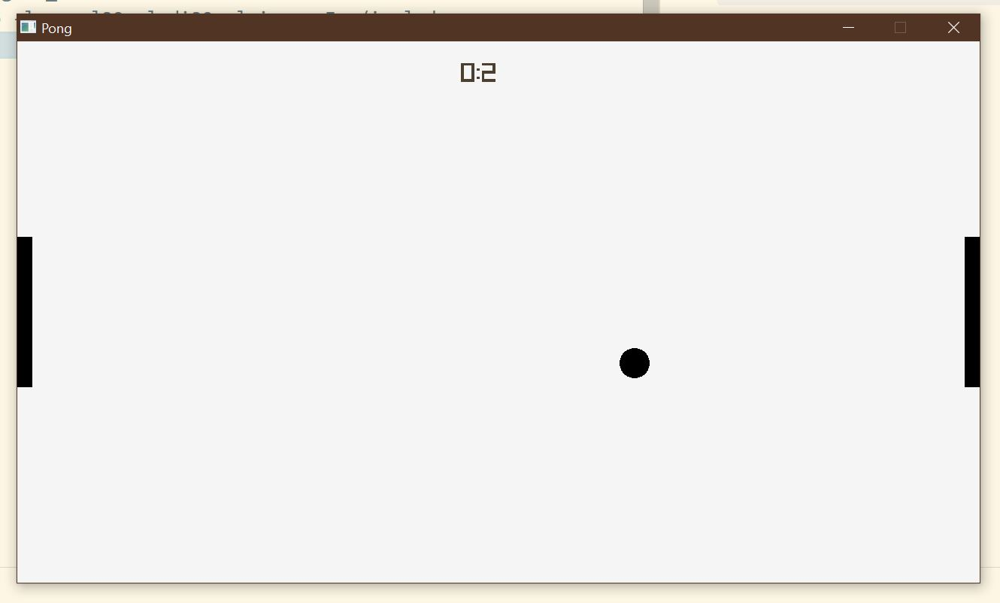

# Pong

## Description
This is a sample project you can use as a starting point to do your own raylib projects.

## Dependencies

You need a precompiled libraylib. I uploaded my x64Win version in the lib Folder but if your system differs use this for instructions on how to build:

[https://github.com/raysan5/raylib/wiki#development-platforms](https://github.com/raysan5/raylib/wiki#development-platforms)

## Compile
Just run in Powershell:
```powershell
	./run.ps1
```

or compile yourself with:

```bash
g++ main.cc engine.cc level.cc audio.cc game.cc game_elements.cc -o ./build/main.exe -O1 -Wall -std=c++17 -Wno-missing-braces -L ./lib -lraylib -lopengl32 -lgdi32 -lwinmm -I ./include  
``` 

## WASM

I plan to compile the game to WASM in the future to enable in browser gameplay.